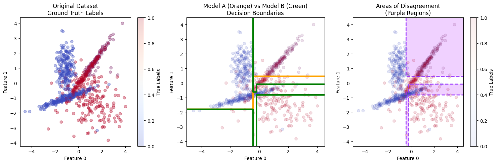

# Tarmac 🚀

Explainable git diff for your ML models - EU AI act compliance in 1 command

[](https://www.gnu.org/licenses/agpl-3.0)
[](https://github.com/adrida/tarmac/actions/workflows/ci.yml)

## Overview

Tarmac is a Python package that helps you understand and document differences between ML model versions, with future support for automated EU AI Act compliance reports. It provides:

- **Model Comparison**: Compare predictions between any two ML models, like git diff
- **Intelligent Sampling**: Use built-in datasets or your own data for comparison
- **Automatic Task Detection**: Supports both classification and regression tasks
- **Explainable Differences**: Generate human-readable rules that explain where and how models differ
- **Flexible Output**: Get results in JSON or text format, with optional user-friendly explanations
- **Future AI Act Support**: Automated report generation for EU AI Act compliance (coming soon)


*Visualization of model comparison: (left) Original dataset with ground truth labels, (middle) Decision boundaries for Model A (orange) vs Model B (green), (right) Areas of disagreement highlighted in purple.*

## Installation

```bash
git clone https://github.com/adrida/tarmac
cd tarmac
pip install -e .
```

## Getting Started

Check out our [quickstart notebook](notebooks/quickstart.ipynb) for an interactive example using a toy dataset to understand how Tarmac works.

## Quick Start

Here's a simple example comparing two classification models using the iris dataset:

```bash
# Compare two models using the built-in iris dataset
tarmac diff model_a.pkl model_b.pkl --sampling builtin --data iris

# Compare models with custom datasets
tarmac diff model_a.pkl model_b.pkl \
    --sampling union \
    --Xa features_a.csv --ya targets_a.csv \
    --Xb features_b.csv --yb targets_b.csv

# Save the analysis to a file with user-friendly explanations
tarmac diff model_a.pkl model_b.pkl -o analysis.txt --uf
```

## Usage Guide

### Basic Commands

The main command in Tarmac is `diff`, which analyzes differences between two models:

```bash
tarmac diff [MODEL_A] [MODEL_B] [OPTIONS]
```

### Sampling Strategies

### Sampling Strategies

Currently, Tarmac implements the sampling strategy from [Dynamic Interpretability for Model Comparison via Decision Rules (Rida et al., 2023)](https://link.springer.com/chapter/10.1007/978-3-031-74630-7_23), which uses the union of both models' training datasets:

1. **Built-in Datasets**:
   ```bash
   tarmac diff model_a.pkl model_b.pkl --sampling builtin --data iris
   tarmac diff model_a.pkl model_b.pkl --sampling builtin --data diabetes
   ```

2. **Custom Datasets**:
   ```bash
   tarmac diff model_a.pkl model_b.pkl --sampling union \
       --Xa features_a.csv --ya targets_a.csv \
       --Xb features_b.csv --yb targets_b.csv
   ```

### Task Types

Tarmac automatically detects whether you're comparing classification or regression models, but you can also specify explicitly:

```bash
tarmac diff model_a.pkl model_b.pkl --task classification
tarmac diff model_a.pkl model_b.pkl --task regression --epsilon 0.1
```

### Output Options

1. **Console Output**: By default, Tarmac prints results to the console
2. **JSON Output**: `--output results.json` for structured data
3. **Text Output**: `--output results.txt` for plain text
4. **User-Friendly**: Add `--uf` for detailed explanations

## Advanced Configuration

- `--min_samples_leaf`: Control the granularity of difference detection (default: 0.01)
- `--epsilon`: Set the threshold for considering regression predictions different (default: 0.05)

## Contributing

We welcome contributions! Please feel free to submit a Pull Request.

## License

This project is licensed under the GNU Affero General Public License v3.0 - see the LICENSE file for details. This license ensures that the community can use and contribute to the project while protecting against commercial exploitation. Any modifications of this software, including when offered as a service over a network, must be made available under the same license.

